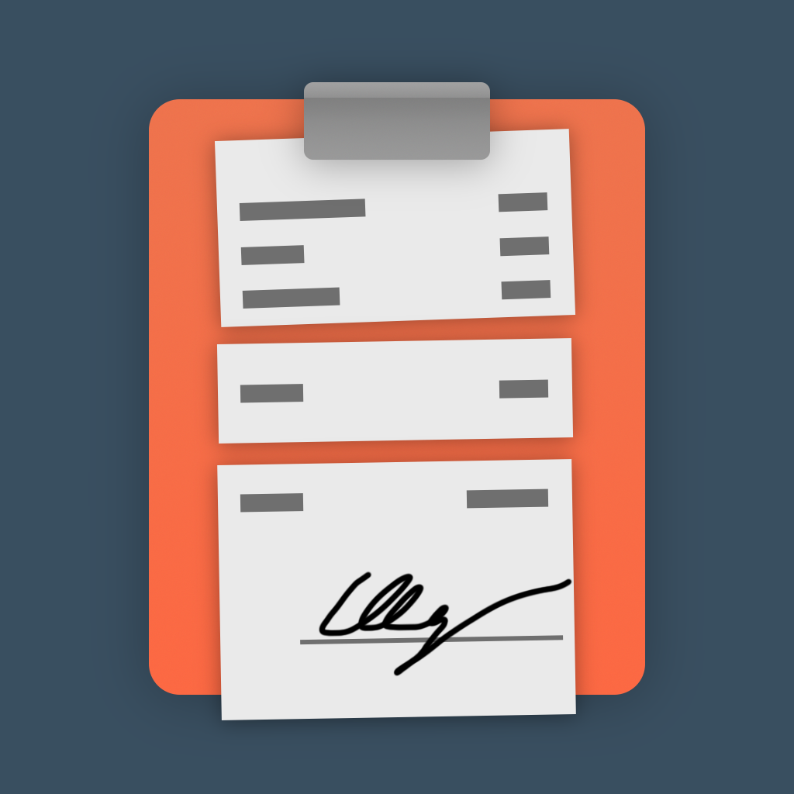

# Check-Splitter-OCR
- iOS/macOS app for splitting bills
- written in Swift and SwiftUI
- reads receipts with OCR powered by Apple's Vision framework
- works like fucking magic 🎩🪄

| [App Store ✅](https://apps.apple.com/app/check-splitter-divide/id1586694735) | [TestFlight ✈️](https://testflight.apple.com/join/AUBmtu4l) |
|--|--|

